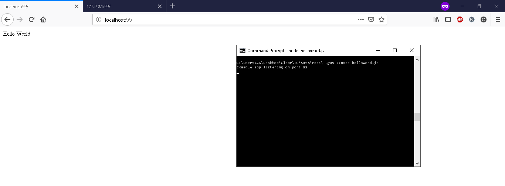

# TUGAS 1 : Helloworld Pada Express Node.js
## Ariiq Firanda N - 05111640000083
### PBKK G

1. Install Node.js dengan npm
2. Clone repository
3. Navigasi ke dalam folder repository
4. Jalankan **npm install express --save** untuk download dependenciesnya
5. Buat script "Hello World!" dan simpan di dalam file (ex:helloworld.js)
6. Jalankan **node helloworld.js** untuk menjalankan script
7. Buka Browser dan akses menggunakan port yang telah dispesifikasikan di dalam file .js ke localhost:port atau 127.0.0.1:port (ex: localhost:99 atau 127.0.0.1:99)
8. Contoh hasil dari script yang dijalankan :

